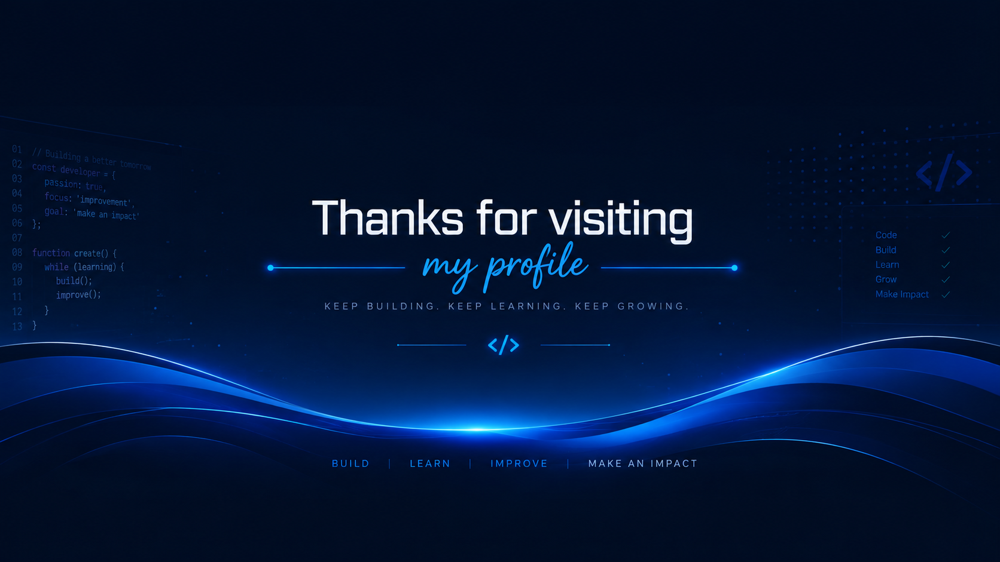

 

# Welcome to my GitHub

**Building modern websites, web applications, and exploring AI.**

---

<h2 align="center">
  
  About Me
</h2>

I'm an Informatics Student who enjoys creating modern, responsive,
and user-friendly digital experiences.

### Areas of Interest

<table align="center">
<tr>
<td align="center" width="200">

**Web Development**

</td>

<td align="center" width="200">

**Full Stack Development**

</td>

<td align="center" width="200">

**Artificial Intelligence**

</td>

<td align="center" width="200">

**Computer Vision**

</td>
</tr>
</table>

I'm focused on improving my development skills and building projects
that combine **clean design, modern technologies, and useful functionality.**

---

<h2 align="center">
  
  Tech Stack
</h2>

### Frontend

### Backend & Database

### Programming & AI

### Tools

---

<h2 align="center">
  
  Featured Project
</h2>

## Personal Portfolio

A modern and responsive personal portfolio built to showcase my
skills, certificates, projects, and development journey.

### Built With

### Highlights

- Modern dark UI
- Responsive design
- Smooth animations
- Interactive components
- Developer-focused layout
- Modern web technologies

---

<h2 align="center">
  
  GitHub Stats
</h2>

  

---

<h2 align="center">
  
  Currently Learning
</h2>

  

`Backend Development` · `REST API` · `Artificial Intelligence` · `Computer Vision`

---

<h2 align="center">
  
  Development Philosophy
</h2>

### Build → Learn → Improve → Repeat

---

<h2 align="center">
  
  Let's Connect
</h2>

&nbsp;&nbsp;&nbsp;

 

